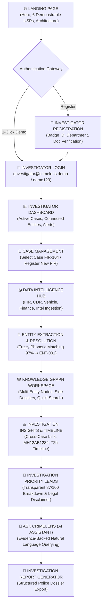

# 🔍 CrimeLens — AI-Assisted Crime Intelligence & Investigation Support Platform

<div align="center">


### **Connect Evidence. Reveal Relationships. Accelerate Investigations.**

*CrimeLens brings fragmented crime records into a unified, explainable investigation workspace — helping detective branches, cyber cells, and station supervisory officers uncover hidden connections, resolve duplicate identities, and prioritize actionable leads.*

[Repository](https://github.com/AviBhosale01/SIH_CI) • [Report Issue](https://github.com/AviBhosale01/SIH_CI/issues)

</div>

---

## ⚡ Core Philosophy & Application Flow

$$\textbf{Connect} \longrightarrow \textbf{Analyze} \longrightarrow \textbf{Visualize} \longrightarrow \textbf{Investigate}$$



---

## 🌟 Six Core Demonstrable USPs

| USP # | Core Capability | Demonstrable Implementation in Prototype |
| :--- | :--- | :--- |
| **01** | **Unified Crime Intelligence** | Ingests and correlates disparate FIRs, CDR telecommunications, financial transfers, and ANPR vehicle tracking into one connected investigation path: `FIR-104` ➔ `Person (Rahul)` ➔ `Phone` ➔ `Vehicle (MH12AB1234)` ➔ `TXN-203` ➔ `Related Case (FIR-087)`. |
| **02** | **Entity Resolution & Deduplication** | Identifies duplicate identities across fragmented police logs (*Rahul Sharma* in FIR-104 vs. *Rahul Sharm* in CDR-202 vs. *Rahul S.* in RTO-019) with a **97% match confidence** using phonetic similarity, shared phone numbers, and common vehicle links, enabling 1-click unification into `ENT-001`. |
| **03** | **Relationship-Based Knowledge Graph** | Interactive network canvas color-coding distinct entity types (Persons, Vehicles, Phones, Locations, Cases, Transactions) with clickable side-panel dossiers and in-graph natural language querying. |
| **04** | **Cross-Case Link Discovery** | Automatically discovers hidden links between independent police cases: surfaces that getaway vehicle **`MH12AB1234`** from Swargate warehouse burglary (`FIR-087`) is owned by prime suspect Rahul Sharma in Kothrud electronics theft (`FIR-104`). |
| **05** | **100% Evidence Traceability** | Every insight, graph edge, and prioritized suspect is traceable with direct citation tags (`[FIR-104]`, `[CDR-202]`, `[VEH-019]`, `[FIN-203]`). |
| **06** | **Explainable Investigation Priority** | Transparent heuristic scoring ($87/100$) evaluating network connectivity ($30/35$), cross-case links ($25/25$), financial anomalies ($18/20$), and evidence strength ($14/20$) with statutory disclaimers. |

---

## 🎬 60-Second Hackathon Hero Demonstration Flow

For live presentations and hackathon evaluation, run this seamless demonstration flow:

1. **Step 1 — Login**: Access the portal via the **1-Click Demo Login** button as Lead Investigator **PI Vikram Patil** (`Badge: MH-PN-4082`).
2. **Step 2 — Case Overview**: Open active case **`FIR-104 — Vehicle & Electronic Goods Theft`** (Kothrud Police Station).
3. **Step 3 — Data Ingestion**: Open **Data Intelligence Hub** to inspect ingested FIR, CDR (14 calls in 48h), vehicle ANPR sightings, and financial transfers.
4. **Step 4 — Entity Resolution**: Open **Entity Extraction & Resolution** to review the candidate match between *Rahul Sharma* and *Rahul Sharm* (Match Score: 97%), and click **"Confirm Match & Merge Entities"** to unify into `ENT-001`.
5. **Step 5 — Knowledge Graph**: Open **Knowledge Graph Workspace** to explore the interactive relational graph. Test the in-graph question: *"How many connections does Rahul Sharma have?"* to see the 4 verified connections appear with evidence citations.
6. **Step 6 — Cross-Case Discovery**: Open **Investigation Insights** to show the critical link: `Case FIR-104 ⟷ Vehicle MH12AB1234 ⟷ Case FIR-087`.
7. **Step 7 — 72-Hour Timeline**: Review the concentrated operational sequence spanning August 10–13, 2026.
8. **Step 8 — Investigation Priority**: View the explainable **87/100** score breakdown for prime target Rahul Sharma.
9. **Step 9 — Ask CrimeLens**: Query the AI assistant with *"Which cases share the same vehicle?"* and view the evidence-backed citation response.
10. **Step 10 — Report Generation**: Click **Compile Structured Intelligence Report** to preview and download the official police dossier.

---

## 📋 Technology & Prototype Truth Matrix

| Module | Prototype Implementation | Production / Proposed Roadmap |
| :--- | :--- | :--- |
| **Authentication & RBAC** | ✅ Implemented (Session Auth, Badge Verification, 1-Click Demo) | Government SSO / CCTNS OAuth2 Integration |
| **Case Management** | ✅ Implemented (CRUD, Priority & Status Filters, Context Switcher) | National Crime Records Bureau (NCRB) ICJS API |
| **Data Ingestion** | ✅ Implemented (Heterogeneous Ingestion, Progress Bar, View & Edit) | Automated ETL pipeline with OCR & ANPR stream processors |
| **Entity Extraction** | ✅ Implemented (Named Entity Classification Table) | Production Fine-Tuned Legal NER (SpaCy / HuggingFace) |
| **Entity Resolution** | ✅ Implemented (Fuzzy String, Levenshtein, Phonetic & Shared Metadata) | Scalable Record Linkage & Graph ML Deduplication |
| **Knowledge Graph** | ✅ Implemented (Plotly + NetworkX, Color Nodes, Dossier Inspector) | Neo4j / AWS Neptune Distributed Graph Database |
| **Cross-Case Linkage** | ✅ Implemented (Deterministic Multi-Case Joint Asset Search) | Graph Neural Networks (GNN) for link prediction |
| **Investigation Priority** | ✅ Implemented (Transparent 4-Factor Weighted Algorithm) | Calibrated Risk Scoring with human-in-the-loop auditing |
| **Investigation Query** | ✅ Implemented (Rule-Based Fallback + Multi-Provider LLM Hook) | RAG Pipeline with CCTNS Vector Embeddings |
| **Dossier Generation** | ✅ Implemented (Structured Police Report Exporter) | Cryptographically Signed Court-Admissible PDF Export |

---

## 🚀 Quickstart Installation Guide

### Prerequisites
- Python 3.10+
- Git

### Step 1: Clone Repository
```bash
git clone https://github.com/AviBhosale01/SIH_CI.git
cd SIH_CI
```

### Step 2: Install Dependencies
```bash
pip install -r requirements.txt
```

### Step 3: Launch CrimeLens
```bash
streamlit run app.py
```

The application will launch automatically at `http://localhost:8501`.

---

## 👨‍💻 Author & Attribution

Developed with ❤️ for **Smart India Hackathon (SIH)** by **Avii**.

[](https://github.com/AviBhosale01)